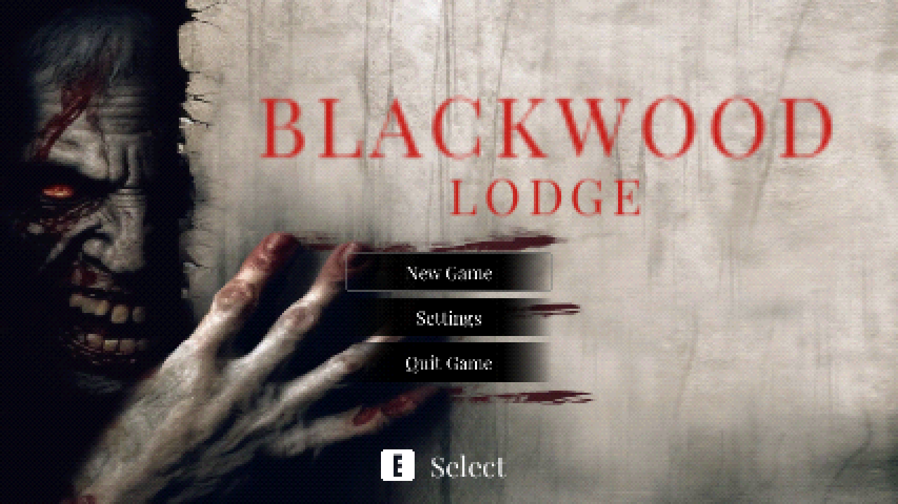
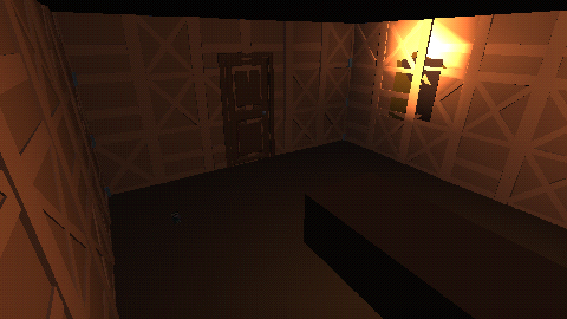

# Blackwood Lodge (demo)

A short survival horror game in the style of the 1990s classics: fixed camera angles, tank controls, a PS1 look, a locked lodge in the rain, a few puzzles and not much ammo. One playthrough takes roughly 15 minutes.

## ⬇️ [Download for Windows](https://github.com/TheDyXer/blackwood-lodge-demo/releases/latest)

Under **Assets**, download `BlackwoodLodge-Windows-v0.1.1.zip` (61 MB).

1. Unzip the whole folder (don't run it from inside the zip).
2. Double-click `BlackwoodLodge.exe`.
3. If Windows says "Windows protected your PC", click **More info**, then **Run anyway**. The game isn't signed by a publisher, so Windows warns about it.

**Updates:** when a new version is out, the game's main menu shows an "Update" button that brings you back here. Your saves carry over.

Needs Windows 10 or 11 (64-bit). Keyboard and mouse or a gamepad. English or Hungarian (Settings → Language). Controls are in `READ ME FIRST.txt` inside the zip, and `WALKTHROUGH-SPOILERS.txt` has every answer if you get stuck.

  
  

## Feedback

Found a bug or got stuck? [Open an issue](https://github.com/TheDyXer/blackwood-lodge-demo/issues).

## About this repository

This repository only hosts downloads. The game's source isn't here and isn't open source; all rights reserved. It's built in Unity on the Retro Horror Template, RoomGen and Sound Shapes (Unity Asset Store), with Mixamo characters and CC0 sounds. Full credits are in `CREDITS.txt` inside the zip.
