# Blackwood Lodge: walkthrough

> **⚠️ Spoilers.** Every puzzle answer is below. If you only need a nudge, read one section at a time.

[⬅ Back to the download](README.md)

Directions are "as you walk in through the door". The pictures are the game's own fixed camera for each room, brightened a little so they're easier to read (the game is darker).

## Map

```
                 STUDY (locked: Hunter Key)
                      |
 SAVE ROOM --- ENTRANCE HALL --- DINING ROOM --- KITCHEN
                      |                             |
                 COURTYARD --- SHED          CELLAR (locked: Cellar Key)
                                                    |
                                               ladder down
                                                    |
                    LAB:  ladder → CORRIDOR → SECURITY OFFICE
                                       |
                                 ELEVATOR ROOM
```

You start in the Entrance Hall facing the **Study** door (locked). The **Save Room** is on your left, the **Dining Room** on your right, and the **Courtyard** behind you.

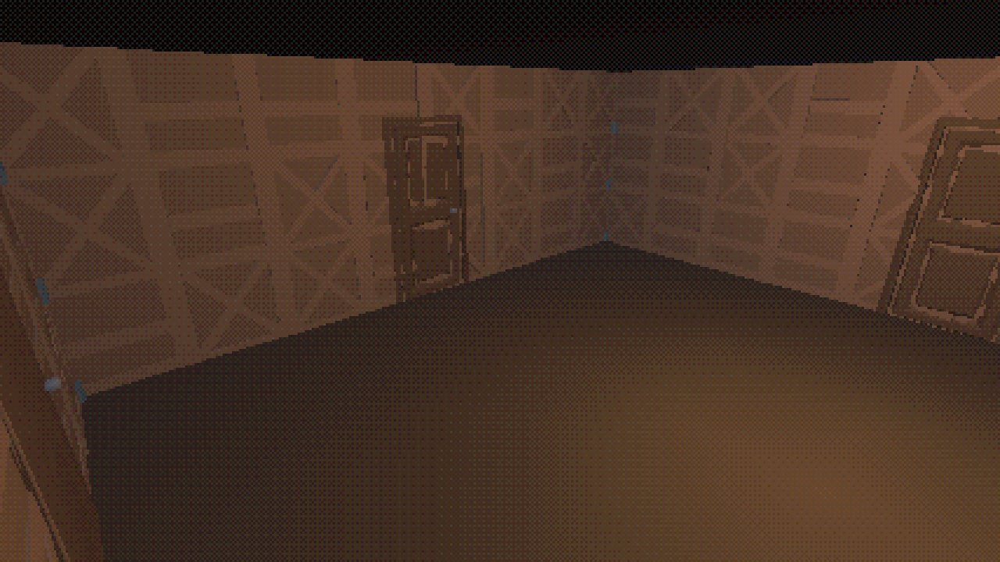

## Controls you'll need

- **Interact / confirm:** E (gamepad: South)
- **Aim:** right mouse (RB or LT), then **shoot** with left mouse (South)
- **Inventory:** I (North). Use herbs and combine items there
- **Push:** walk into a crate or shelf and keep walking. After about a second Cole starts pushing
- **Run:** Left Shift (West). **Quick turn:** Q (RT)

## 1. Save Room (optional, recommended)

On your left from the start.

- 2 ink ribbons on the floor a few steps in, slightly to your left, and a green herb by the door.
- The typewriter (save, uses one ink ribbon) is on the right wall. The item box is on the far wall: store whatever you don't need, since inventory space is limited.

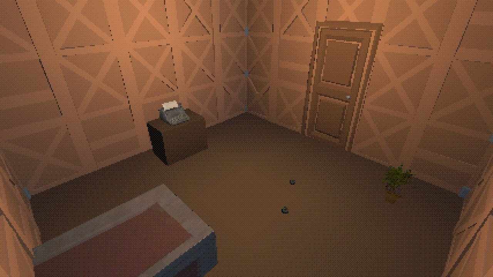

## 2. Dining Room: the safe code

On your right from the start. **One zombie** stands on the far side of the table, near the kitchen door. Shoot it.

- **10 handgun rounds** in the corner on your right as you enter.
- **The portrait** hangs on the long wall to your left, close to the door you came in by, under a small lamp. Examine it: the plaque reads **"Built by Elias Blackwood, 1931."** That's the safe code.

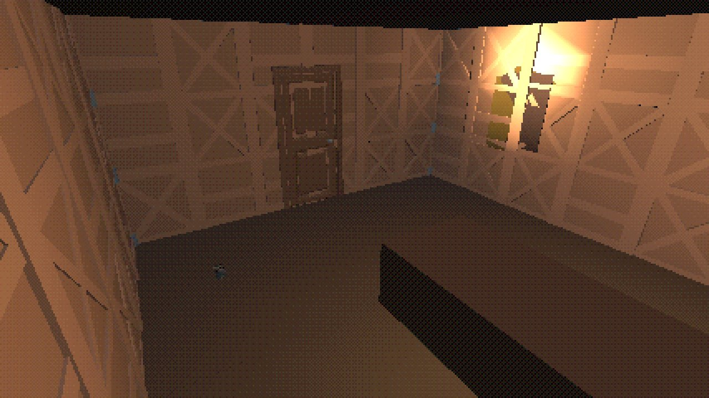

## 3. Kitchen

Through the door on the far side of the Dining Room. **One zombie** waits in the far-left corner (the pantry).

- **Green herb** in the near-left corner, **10 handgun rounds** on the floor in the middle of the room.
- The **Cellar** door on the right-hand wall is locked. You'll come back with the Cellar Key.

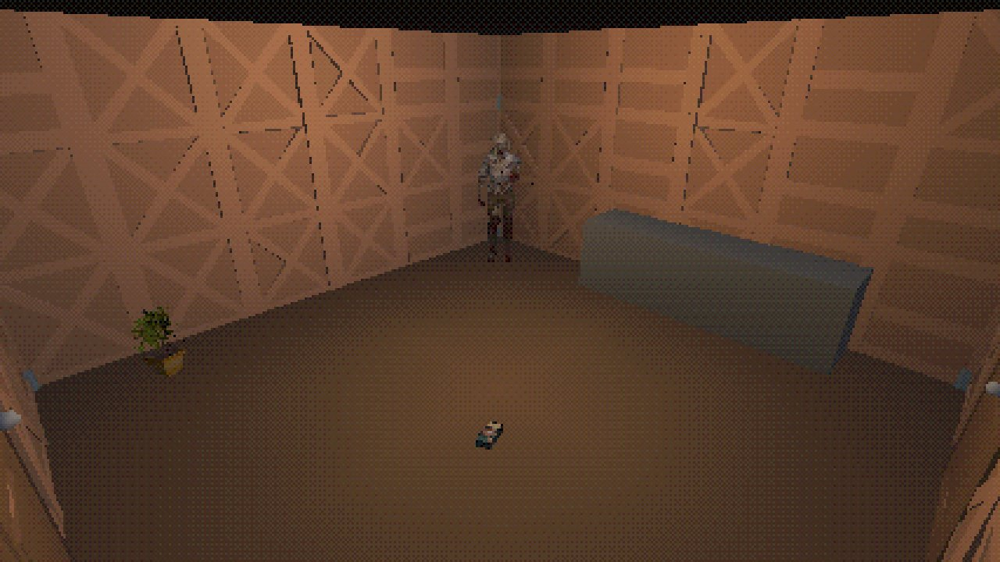

## 4. Courtyard and Shed: the Hunter Key

The Courtyard is behind you from the start. **Two zombies** are outside.

- **Red herb** in the far-right corner. Combine it with a green herb in the inventory for a stronger heal.
- The **Shed** door is on the left-hand wall.

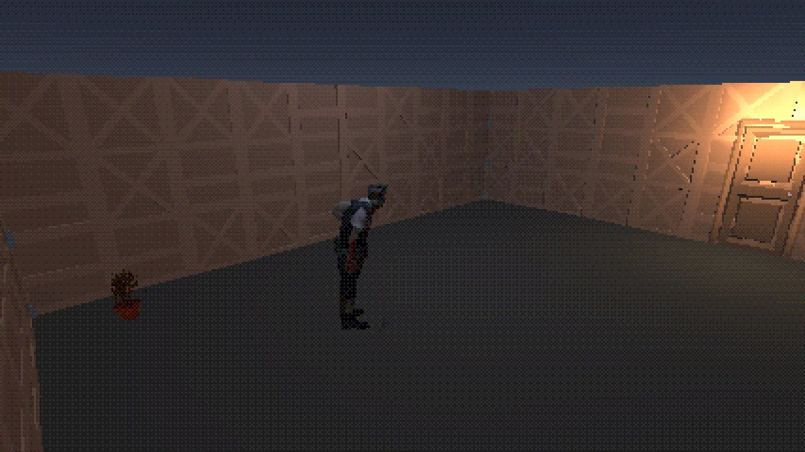

**Shed puzzle:** the crate stands in the middle of the shed, inside a frame of low wooden sills on the floor. The pressure plate is a light metal square inside the same frame, about 1.8 m to the crate's right. The cabinet with the key is on the far wall.

1. Go to the crate's left side (the side away from the plate).
2. Push it **to the right**, about 1.8 m, until it sits on the metal plate.
3. The plate clicks, the cabinet opens and the **Hunter Key** appears inside. Take it.

The crate only slides inside the frame: at the sills it stops. It can't get stuck against a wall, so you can always walk around it and push it from another side.

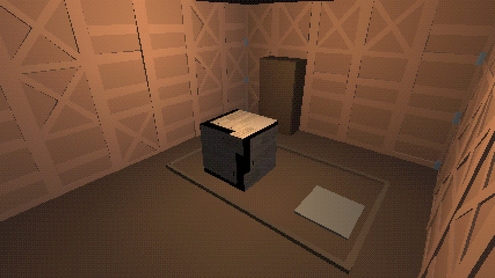

## 5. Study: the Cellar Key

Back in the Entrance Hall, use the **Hunter Key** on the Study door straight ahead.

- **Ink ribbon** in the near-right corner.
- **Father's note** on the desk on the left: "Father set the safe to the year Grandfather built this place. His portrait still hangs where we ate."
- The **wall safe** and its **keypad** are on the far wall. Interact with the keypad, move the cursor over the buttons and press **1, 9, 3, 1**. A wrong 4-digit code clears the display and you can try again.
- The safe opens: take the **Cellar Key**.

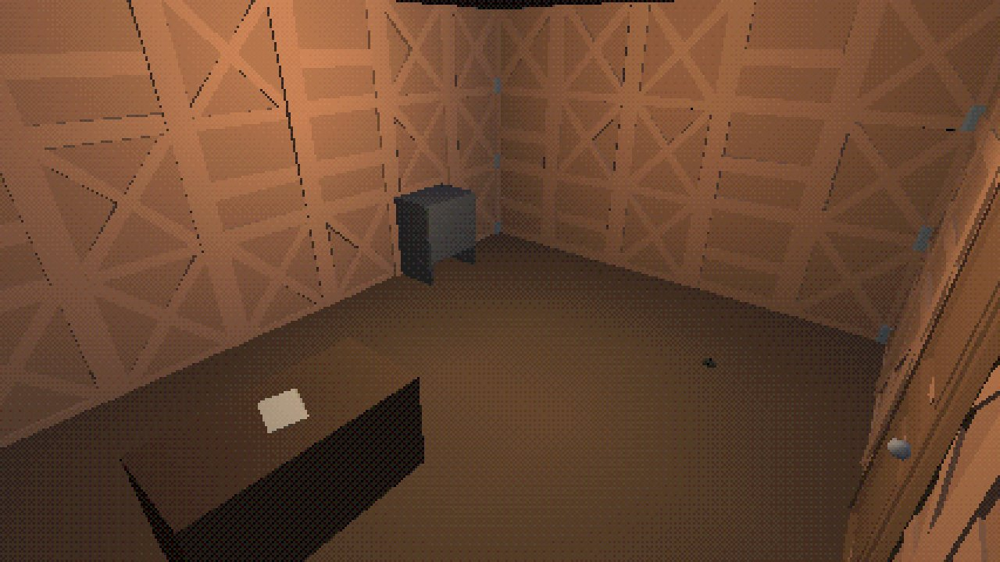

## 6. Cellar: the way down

Go to the Kitchen and use the **Cellar Key** on the door in the right-hand wall.

- **One zombie** stands close, to your left.
- **10 handgun rounds** in the near-right corner.
- A heavy **shelf** stands against the far wall, on the left. It slides only sideways along that wall: stand at one end and push it toward the other. Under it is a **hatch**. Once the shelf is off the hatch, interact with the hatch to climb down to the Lab. The shelf stays where you left it, even after loading a save.

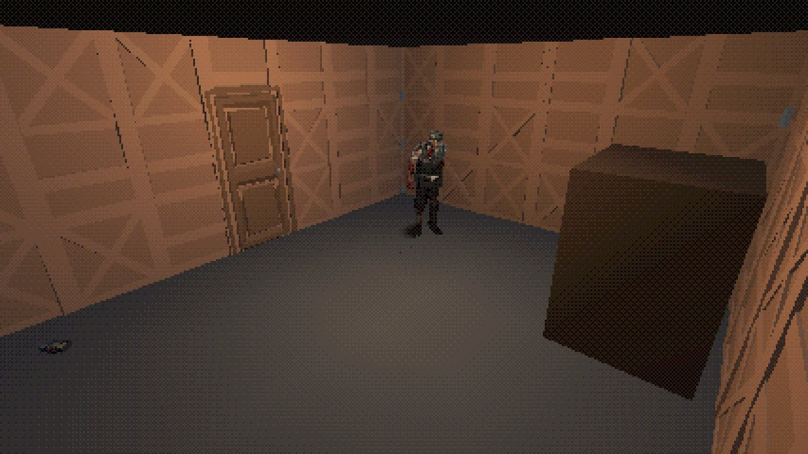

## 7. Lab Corridor

You arrive at the foot of the ladder at one end of a long corridor. **Two zombies** are ahead.

- **Lockers** on the left-hand wall, right next to the ladder: the **middle locker holds 6 shotgun shells**.
- **Green herb** at the far end, on the right.
- At the far end is the **Security Office** door. On the left wall, near the far end, is the **Elevator Room** door. Go to the Security Office first.

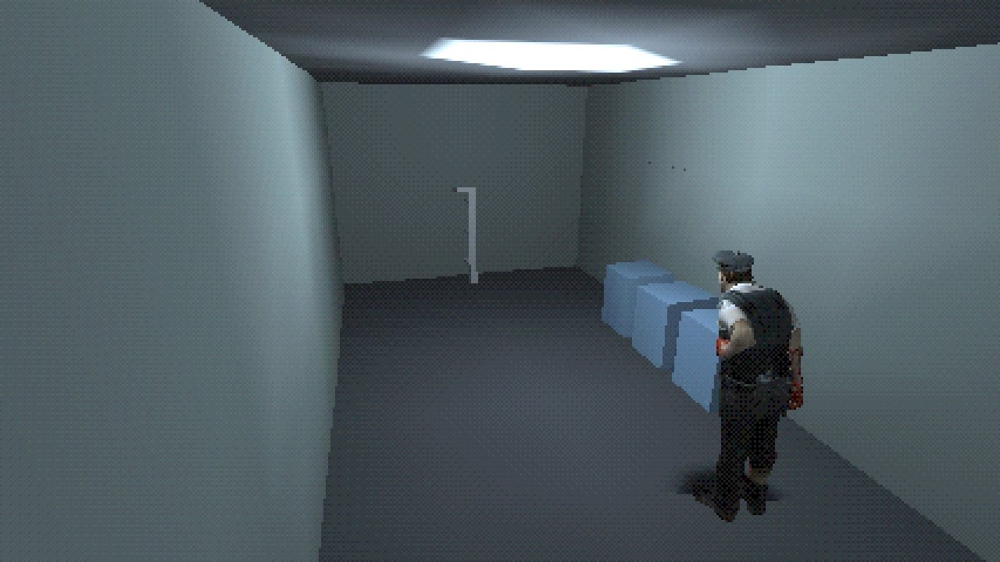

## 8. Security Office

- On the desk on the left: the **shotgun (6 shells loaded)**, the **Lift Keycard** and the **incident report** (it warns you about what comes next).
- **Typewriter** in the near-left corner (no item box down here). Save now if you have a ribbon.
- **Green herb** in the far-right corner.

Equip the shotgun and load the shells from the locker before you go on.

<p>
  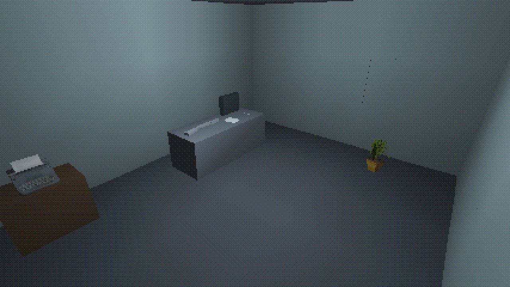
  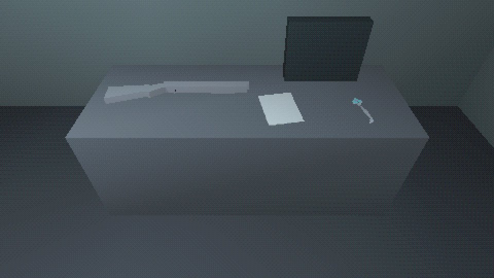
</p>

## 9. Elevator Room: the finale

- The **keycard reader** is on the far wall, to the right of the lift doors. Use it and answer **Yes** to use the **Lift Keycard**.
- The lift takes **60 seconds** to come down, and **the boss appears** near the door you came in by. You don't have to kill it: survive. Keep moving, shoot it with the shotgun when it closes in, and heal with herbs.
- When the lift arrives (a ding and the doors open), **walk into the lift**. The ending plays, then the rank screen, then the main menu.
- Saving during the wait is safe: loading that save keeps the countdown (or the open lift).

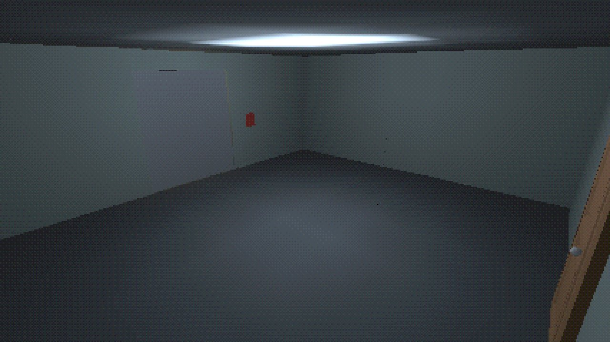

**Ranks:** S = under 10 minutes with at most 1 save, A = under 15 minutes, B = anything else.

## Item totals

7 zombies + 1 boss, 4 green herbs, 1 red herb, 3 ink ribbons, 45 handgun rounds (15 loaded + 3 boxes of 10), 12 shotgun shells (6 loaded + 6 in the locker).
